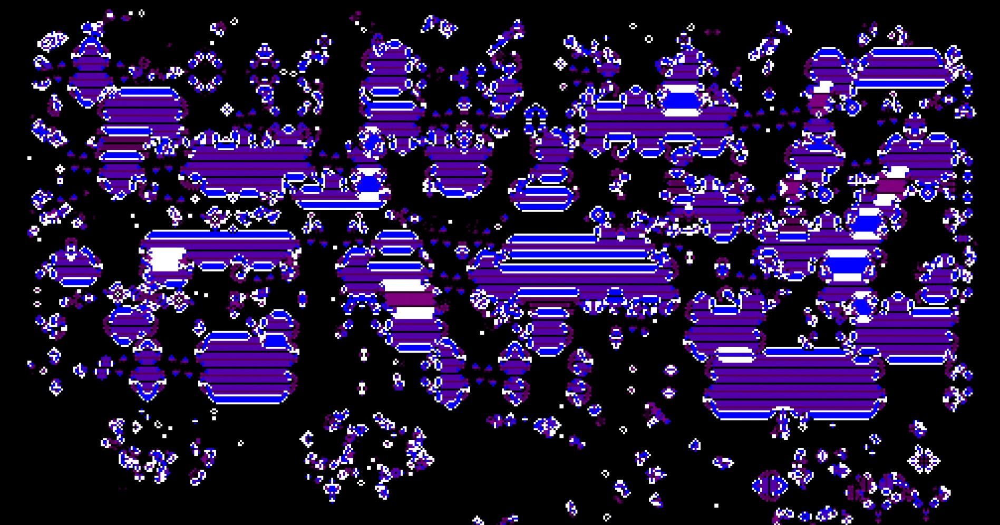

# Game of Life

This is my rendition of Conway's Game of Life in Python. This implementation uses a set of live cells to optimize rendering of the next generations. This way it only renders the cells that have changed since the previous generation to save computation.



## Getting Started

```
pip install -r requirements.txt
python3 gol.py
```

## How to Play

The game starts with an empty black screen. You can then click and/or drag your mouse to select the starting live cells. Once you've chosen the starting cells, click `Spacebar` to start the game. To quit and restart, exit the window, and run again.
